# Deploying a Dart server to a VPS

_A step-by-step tutorial_

<div style="text-align: center;">
    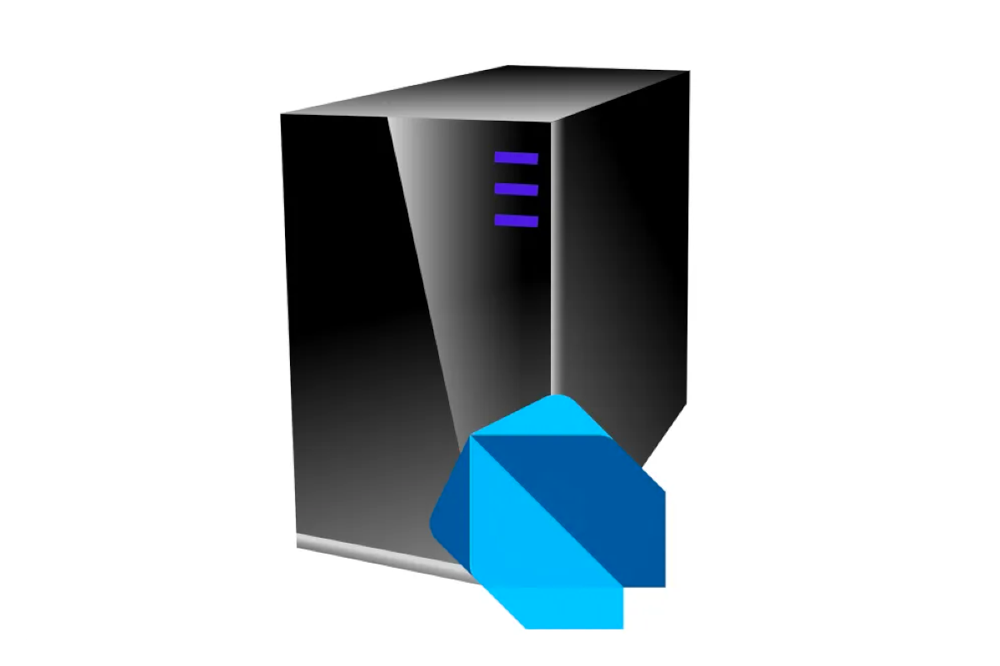
</div>

_Published May 2024_

## Introduction

I've always been a fan of taking control of your own backend infrastructure. While there are many Cloud based solutions like Firebase and Supabase, the pricing is often unclear. They may start free for a few small projects, but then they get expensive. I suppose if your app is making a lot of money or you have a lot of investment capital, then it's fine, but that hasn't been my situation in the past. The cheapest option I've found with a clear pricing structure is to run your own virtual private server (VPS).

Of course, going the cheap route means you have to do a lot more work. But that work is also a good learning experience. I've set up my own servers quite a few times over the years, both for hosting web pages and for running backend Dart API servers for Flutter apps. In this article, I'll walk you through the steps to do that yourself.

We'll use the following tech stack:

- Ubuntu
- Nginx (web server, reverse proxy)
- Docker (Dart server container)

As far as how you create your Dart server, that's up to you. I like to use [Shelf](https://pub.dev/packages/shelf), but [Serverpod](https://serverpod.dev/) is another great option. This article will focus very little on the Dart server itself. In fact, you can use this tutorial to set up any Docker-based server you like.

## Step 0: Preparation

We're going to start from scratch, so I won't assume you already have a VPS or even a domain name. You'll need to prepare both of those now.

### Getting a VPS

A VPS is a **virtual private server**. That means your server will be running on one physical computer at some specific location in the world. The virtual part means that from your OS's perspective, it thinks it has the computer to itself, but it is probably actually sharing the underlying hardware with other users who have purchased VPSs from the hosting company. If you want the hardware all to yourself, then you need to rent or buy a dedicated server, which tends to be more expensive.

I'd recommend getting a VPS that has the following specs at a minimum:

- 1 GB of RAM
- 1 CPU core
- 10 GB of storage
- 500 MB of monthly bandwidth

There are many VPS providers. You can use whichever you like, but I currently use DigitalOcean and RackNerd.

> Note: My affiliate links are [DigitalOcean](https://m.do.co/c/523712b8d418) and [RackNerd](https://my.racknerd.com/aff.php?aff=10538) if you want to help me out.

I like DigitalOcean because of their great tutorials and reliable VPSs. (I've used some smaller VPS providers before that went out of business. And that's a pain to deal with.)

I like RackNerd because they have very inexpensive VPSs. At the time of writing, they have a 1 GB VPS for less than $1/month. And so far they've been pretty reliable. I had some trouble with the VPS being slow once or twice, but when I contacted support, they resolved the problem quickly.

You can also search [LowEndBox](https://lowendbox.com) for deals on VPSs. Just be aware that some of the companies on this list are not very reliable.

For this article, I'm going to purchase a VPS from RackNerd. If you use DigitalOcean, they refer to their VPSs as "Droplets".

I chose a 1 GB KVM VPS with the following specs:

- 1 vCPU Core
- 21 GB PURE SSD RAID-10 Storage
- 1 GB RAM
- 1500GB Monthly Premium Bandwidth
- 1Gbps Public Network Port
- Full Root Admin Access
- 1 Dedicated IPv4 Address
- KVM / SolusVM Control Panel

For that VPS, I selected the following configuration options:

- Ubuntu 22.04 64-bit
- Location: New York

In general, it's good to choose a location near your users if possible. However, we'll also put the server behind a Cloudflare CDN, so that will help for static content that can be cached.

You can choose a newer version of Ubuntu if available, but you might need to update some of the commands in this tutorial.

After you make the purchase, you should get an email that includes the IP address of your server and password for the root user. Yours will be different, but my IP is `107.175.2.52`.

Next, you should get a domain name, and point it at your IP address.

### Registering a domain name

While it's technically possible to hardcode your server's IP address into your frontend Flutter app, what would you do if your VPS provider changed your IP address? (That's happened to me several times with some of the smaller VPS providers.) All of your Flutter apps would break. That means you should get a domain name that points to your server's IP address. 

You can use whatever domain registrar you want, but I'll use [Cloudflare](https://www.cloudflare.com/products/registrar/) because they sell the domain names at cost. We also want to use their CDN services. A CDN is a **content delivery network**. It's a service that takes static content from your server and caches it on servers around the world so that the response time for users is faster.

Cloudflare requires domains that are registered with them to use their CDN. So if you don't want that, you should choose a different domain registrar. If you are serving a lot of large files, you might eventually have to start [paying](https://developers.cloudflare.com/r2/pricing/), but even then they're probably the cheapest of the options. From what I hear, they're much cheaper than AWS. Cloudflare doesn't charge for egress (data transfer to the internet) but rather for things like storage and data operations.

I registered the following domain:

- learndart.dev

That makes this tutorial the first article I'll post on that site. From here on, everywhere you see `learndart.dev`, you can substitute your own domain name.

> **Note**: If you already own a domain name and you don't want to pay for another one, you can point your server to a subdomain of it. For example, if you own `example.com`, you can point your server to `myapp.example.com`.

After getting your domain name, go to your DNS settings and add an `A` record for the top-level domain. Also add `A` records for the `www` and `myapp` subdomains. For each of these, point them to your IP address. Here's what mine looks like:

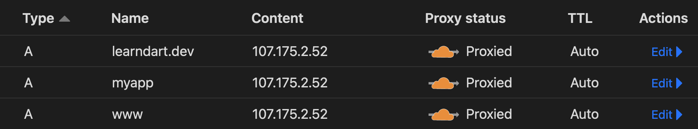

> **Note**: If you are only using a subdomain like `myapp.example.com` instead of a top-level domain, you would only add the A record for `myapp` and leave `example.com` and `www` as they are. It's perfectly fine for one server to serve a subdomain while another server handles the top-level domain.

It should only take a few seconds or at most a few minutes for Cloudflare to resolve the `A` records for your IP address. If you're using another DNS registrar, though, it could take longer. That's why I'm having you do this step at the beginning of the tutorial.

You can look up the IP address or DNS name with the following tools:

- [DNS lookup](https://mxtoolbox.com/DNSLookup.aspx)
- [Reverse IP lookup](https://mxtoolbox.com/ReverseLookup.aspx)

Neither are very helpful at this point, though, because you haven't set up the web server yet. Even if you lookup [learndart.dev](https://mxtoolbox.com/SuperTool.aspx?action=https%3a%2f%2flearndart.dev%2f&run=toolpage), which should be working by the time you read this tutorial, it will show a different IP address than the one I registered on Cloudflare. That's because Cloudflare masks it for security and performance reasons. (Please don't hack me now.)

If you try to visit your new domain in a browser now, Cloudflare will tell you the server is down. You'll fix that soon.

### Where you're headed

To give you a preview of what's to come, these are the domains and subdomain types you'll be hosting:

- `learndart.dev`: Host a website at your top-level domain.
- `www.learndart.dev`: The `www` subdomain will serve the same content as the top-level domain.
- `myapp.learndart.dev`: Host a landing page for MyApp at the `myapp` subdomain.
- `myapp.learndart.dev/api`: Serve the API for MyApp.

If you bought a domain that you'll use exclusively for a single app, you could also do the following:

- `learndart.dev`: Host a landing page for MyApp.
- `www.learndart.dev`: Same as above.
- `api.learndart.dev` or `learndart.dev/api`: Serve the API for MyApp.

The advantage of using a generic top-level domain and an app-specific subdomain is that you can add as many apps as you want in the future without needing to buy new domains. If they are low-traffic, you can host them on the same server. If they're high traffic, you can point a subdomain to the IP address of a different server.

Much of the process for the remainder of this tutorial I learned from DigitalOcean's tutorials. I'll be following the same general procedure but will streamline the process and give my own abbreviated commentary. If you want more details, refer to the following guides:

- [Initial Server Setup with Ubuntu](https://www.digitalocean.com/community/tutorials/initial-server-setup-with-ubuntu)
- [How to Set Up SSH Keys on Ubuntu 22.04](https://www.digitalocean.com/community/tutorials/how-to-set-up-ssh-keys-on-ubuntu-22-04)
- [How To Install Nginx on Ubuntu 22.04](https://www.digitalocean.com/community/tutorials/how-to-install-nginx-on-ubuntu-22-04)
- [How To Secure Nginx with Let's Encrypt on Ubuntu](https://www.digitalocean.com/community/tutorials/how-to-secure-nginx-with-let-s-encrypt-on-ubuntu-22-04)
- [How To Install and Use Docker on Ubuntu 20.04](https://www.digitalocean.com/community/tutorials/how-to-install-and-use-docker-on-ubuntu-20-04)
- [Install Docker Engine on Ubuntu](https://docs.docker.com/engine/install/ubuntu/) (Docker docs)

## Step 1: Ubuntu Server

In this section, you'll go through the process of configuring your new Ubuntu Linux server. That'll involve updating the system and improving on the default security.

### Logging in

Find the IP address and root password that you received in the email from your VPS provider. 

Then use `ssh` to log into your server. This command line tool is available by default on Mac and Linux. Windows users can use [PuTTY](https://www.putty.org/).

```bash
ssh root@107.175.2.52
```

Notes:

- Use your own IP address, not mine, of course.
- The first time you connect, you'll get a warning about the authenticity of the host. Type "yes" to continue.
- When entering the password, the cursor won't move. Just paste it in and press enter.

If everything was successful, you should be logged into your remote machine. 

<div style="text-align: center;">
    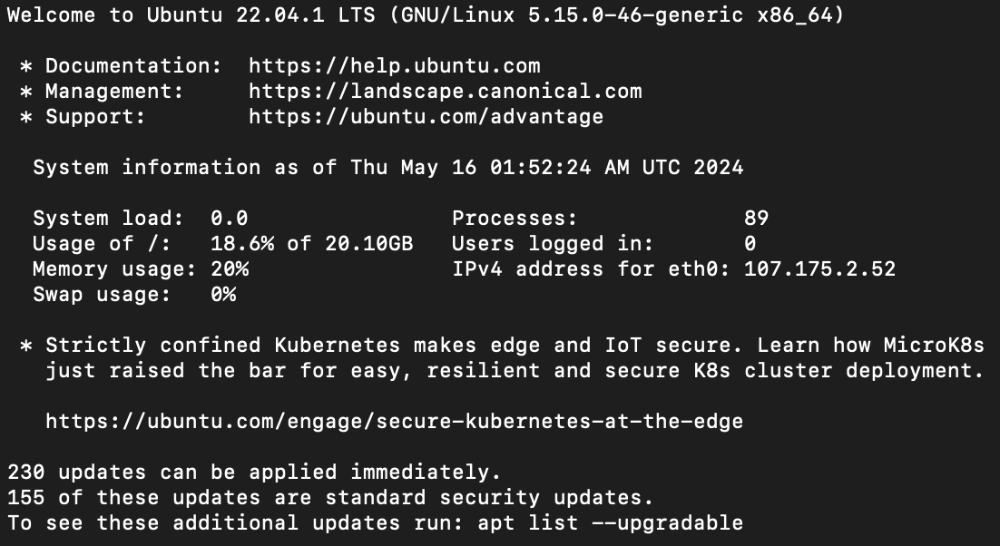
</div>

Do you feel like a real hacker now?

Check the OS version of your system:

```
lsb_release -a 
```

It should be Ubuntu 22.04 LTS (or newer). LTS stands for Long-Term Support. This means it receives security updates for 5 years.

### Updating the OS software packages

Check for software updates:

```
apt update
```

Upgrade the software packages:

```
apt upgrade
```

This may take a while. Accept the defaults when prompted.

If you get a message about a newer kernal being available, press the **spacebar** to select `<Ok>`.

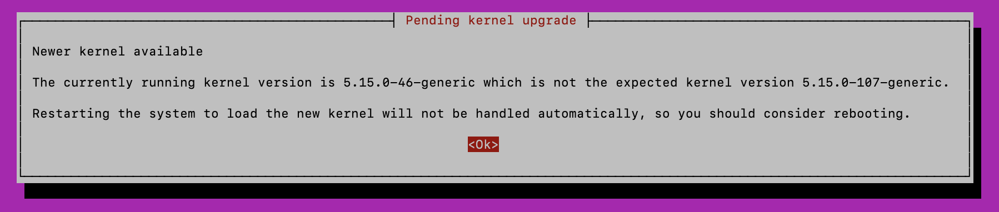

If you get a message about which services to restart, you can accept the defaults. Press **tab** to highlight `<Ok>` and then **spacebar** to confirm.

<div style="text-align: center;">
    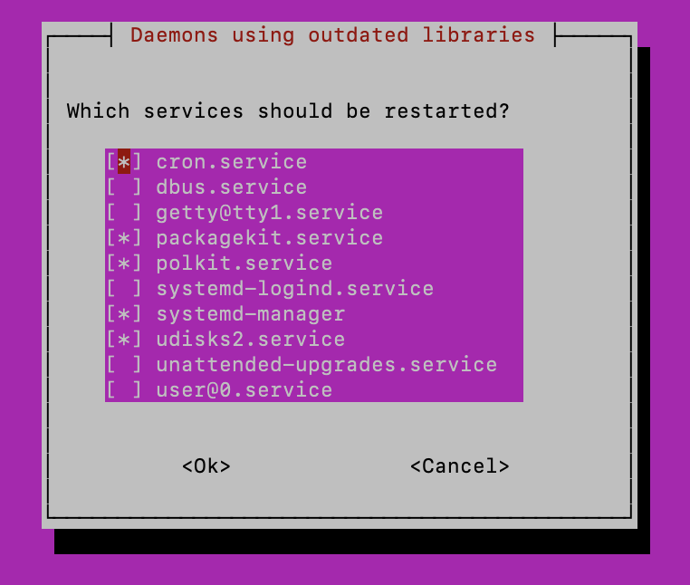
</div>

Reboot the machine so you can apply your kernal upgrade:

```
reboot
```

This will kick you out. 

> **Note**: If you leave the terminal connection idle for a long time, it may become unresponsive. In that case, close the terminal and open a new one to log back in.

Log back in:

```
ssh root@107.175.2.52
```

It takes a few minutes for the server to reboot, so you may be rejected a few times.

### Adding a new user

It's more secure not to use the root user for everything. Create a new user account for yourself. You can use your name or a nickname. I'll just use `me`:

```
adduser me
```

You'll need to enter a password. You can leave the other information blank.

Add your new `me` user to the sudo group:

```
usermod -aG sudo me
```

This allows `me` to perform superuser (root) tasks by prefixing commands with `sudo`.

### Setting up a firewall

Next, let's set up the firewall. Make sure that ssh is allowed so that you don't lock yourself out of your own server:

```
ufw allow OpenSSH
```

Check the settings now:

```
ufw app list
```

You should see OpenSSH listed as an available application.

Enable the firewall:

```
ufw enable
```

Choose `y` (yes) when prompted.

Check the status:

```
ufw status
```

Let's make sure that you can still get it. First, log out of your server:

```
exit
```

Then log back in with your new user:

```
ssh me@107.175.2.52
```

Remember that the cursor won't move as you type in the password you just created.

Good. You're not locked out and your new user is working.

### Disabling password login

Next you're going to improve the security even more by not allowing anyone to log in with a password. For that you'll use `ssh` keys.

Log out of the server again:

```
exit
```

If you've never generated SSH keys before, you'll need to do that now. Enter the following command. (If you've previously generated the public/private key pair, you don't need to do it again. Go on to the next command.)

```
ssh-keygen
```

When prompted for a password, it's a good idea to use one, but it's not required. The key itself is your password. However, if someone steals your private key and you didn't use a password, they'll be able to log into your server.

Next, copy your public key to your server using `ssh-copy-id`. (If you don't have `ssh-copy-id` available on your machine see the [DigitalOcean guide](https://www.digitalocean.com/community/tutorials/how-to-set-up-ssh-keys-on-ubuntu-22-04) for other options.)

```
ssh-copy-id me@107.175.2.52
```

Log into you server again as `me`:

```
ssh me@107.175.2.52
```

You're going to disallow password authentication now. 

Edit the `sshd_config` file:

```
sudo nano /etc/ssh/sshd_config
```

When entering a `sudo` command, you need to enter your `me` user password. Subsequent uses of `sudo` will not require it for a while.

Scroll down in the file until you find `PasswordAuthentication`. Alternatively, you can press **Ctrl+w** to search. Uncomment the line by removing the `#` and change the value to `no`:

```
PasswordAuthentication no
```

Then save the file by pressing **Ctrl+X** to exit, then `y` to save changes, and **enter** to confirm the file name.

Now restart ssh:

```
sudo systemctl restart ssh
```

Let's test that it is working. Log out again:

```
exit
```

And then log back in:

```
ssh me@107.175.2.52
```

The only password you'll be asked for is your `ssh` key password, if you set one.

That completes the initial hardening of your server security. Good work!

## Step 2: Nginx

[Nginx](https://nginx.org/) is a web server that will take incoming requests and route them to the appropriate location.

### Installing Nginx

We'll have requests coming in for the following primary locations:

```
learndart.dev
www.learndart.dev
myapp.learndart.dev
myapp.learndart.dev/api
```

Nginx will help us see that they get to the right place.

First, install Nginx:

```
sudo apt install nginx
```

Check what apps are available to the firewall:

```
sudo ufw app list
```

You'll see the following:

```
Available applications:
  Nginx Full
  Nginx HTTP
  Nginx HTTPS
  OpenSSH
```

We want to allow both HTTP and HTTPS traffic to our server, so run the following command:

```
sudo ufw allow 'Nginx Full'
```

Confirm that the change was made:

```
sudo ufw status
```

You should see `Nginx Full` in the list.

Make sure that Nginx is running:

```
systemctl status nginx
```

It should be running already, but if not, check the [DigitalOcean guide](https://www.digitalocean.com/community/tutorials/how-to-install-nginx-on-ubuntu-22-04) for more help.

### Testing the default setup

Visit your server's domain name or IP address in the browser:

- [http://107.175.2.52/](http://107.175.2.52/)
- [http://learndart.dev/](http://learndart.dev/)

You should see a basic web page from Nginx:

<div style="text-align: center;">
    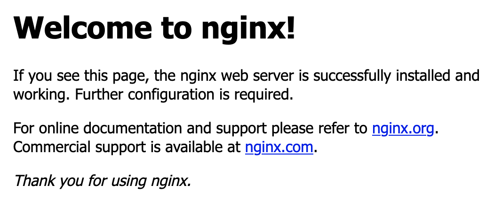
</div>

The HTML for that page is stored in the `/var/www/html` folder.

> **Note**: If you have a .dev site and you know that .dev is only visible in a browser if you've set up an SSL certificate, you might be wondering why you can see it. The reason is that Cloudflare provides SSL certificates for all cites that they register. Read more about that [here](https://developers.cloudflare.com/ssl/concepts/). You'll set up your own SSL certificate later in the tutorial, so if you didn't go with Cloudflare, that's fine.

### Hiding the version number

If you go to a page that doesn't exist, you'll see the version number of Nginx. For example, visiting [http://107.175.2.52/pinkelephants](http://107.175.2.52/pinkelephants) looks like so:

<div style="text-align: center;">
    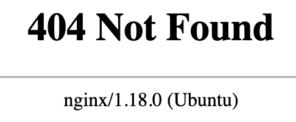
</div>

You can make hackers work a little harder by hiding the version number. That way if there's a known vulnerability in some version and you haven't updated Nginx yet, at least you're not advertizing it.

Open the main configuration file for Nginx:

```
sudo nano /etc/nginx/nginx.conf
```

These settings apply to all sites served by Nginx.

Find the following line in the `html` block and uncomment it by removing the `#`:

```
server_tokens off;
```

This will hide the version number.

While you're here, you might want to browse the rest of the file. This is where you'll come to make other adjustments. For example, if you wanted to increase the maximum upload size to 20 MB (I believe the default is 1 MB), you'd add the following line to the `http` block:

```
client_max_body_size 20M;
```

When you're finished browsing, the file and exit.

Make sure that you didn't break anything. Run the following command to test the configuration:

```
sudo nginx -t
```

Assuming everything is good, restart Nginx:

```
sudo systemctl restart nginx
```

Now, if you visit [http://learndart.dev/pinkelephants](http://learndart.dev/pinkelephants), you won't see the version number.

<div style="text-align: center;">
    
</div>

Take that, hackers! 

(Actually, I shouldn't joke like that. I really don't want to challenge anyone to the task.)

### Disabling the default site

We don't want the default site interfering with the rest of the tutorial, so disable the config file by unlinking it from Nginx's `sites-enabled` folder:

```
sudo unlink /etc/nginx/sites-enabled/default
```

That config file is still in the `/etc/nginx/sites-available` folder. You haven't deleted it, but after restarting Nginx, Nginx will no longer serve that default site. You'll create your own content to serve.

### Creating new sites

We have two different web sites to create:

1. `learndart.dev`
2. `myapp.learndart.dev`

The first one is our generic site and the second one is our app specific site. 

> **Note**: If you already have a working top-level domain that is served somewhere else, then just follow the directions for `myapp.learndart.dev` below. Or, if you're domain is solely for MyApp, then follow the directions for `learndart.dev`.

You'll store the web content in the `/var/www` directory and create separate folders for each site.

#### Adding the generic site

Make a folder for the `learndart.dev` website content:

```
sudo mkdir -p /var/www/learndart.dev/html
```

The `-p` creates the parent folders if they don't exist.

Change the owner to your user, which is `me` in my case:

```
sudo chown -R $USER:$USER /var/www/learndart.dev/html
```

Also apply the appropriate permissions:

```
sudo chmod -R 755 /var/www/learndart.dev
```

Add an `index.html` file:

```
nano /var/www/learndart.dev/html/index.html
```

And paste in some temporary content:

```
<html>
    <head>
        <title>Learn Dart</title>
    </head>
    <body>
        <h1>Welcome to LearnDart.dev!</h1>
    </body>
</html>
```

Save and exit with **Ctrl+X**.

#### Adding the app specific site

Repeat what you did above, this time for your app site:

```
sudo mkdir -p /var/www/myapp.learndart.dev/html
sudo chown -R $USER:$USER /var/www/myapp.learndart.dev/html
sudo chmod -R 755 /var/www/myapp.learndart.dev
nano /var/www/myapp.learndart.dev/html/index.html

<html>
    <head>
        <title>MyApp</title>
    </head>
    <body>
        <h1>Welcome to MyApp!</h1>
    </body>
</html>
```

Eventually you'll want to replace those pages with full websites. If you'd like a Dart-based solution, consider [Jaspr](https://docs.page/schultek/jaspr) or [Static Shock](https://staticshock.io/), which this site is made with (or will be by the time I finish this tutorial).

Next, you need to route the incoming traffic to the correct locations.

### Configuring Nginx to serve the sites

First you'll configure the generic site. Then you'll do the app-specific site.

#### Configuring the generic site

Create the following Nginx configuration file for `learndart.dev`:

```
sudo nano /etc/nginx/sites-available/learndart.dev
```

Add the following content:

```
server {
    listen 80;
    server_name learndart.dev www.learndart.dev;

    location / {
        root /var/www/learndart.dev/html;
        index index.html;
    }
}
```

This is an Nginx server block. Here are a few notes about it:

- Nginx listens on port `80` (the port for HTTP connections).
- This server block handles requests coming in for `learndart.dev` and `www.learndart.dev`.
- Any path starting at location `/` (that is, `learndart.dev/`) will look for files in the `html` folder you created earlier. 
- If a specific file isn't requested, Nginx will use `index.html` as the default.

Save your changes and exit `nano`.

You've configured the server for `learndart.dev` by adding that file to the `sites-available` folder. However, it's not live until you link it to the `sites-enabled` folder. Do that by creating a symbolic link:

```
sudo ln -s /etc/nginx/sites-available/learndart.dev /etc/nginx/sites-enabled/
```

Before restarting Nginx, test that there are no errors in the configuration file:

```
sudo nginx -t
```

> **Note**: If you have a server name that's really long, you might need to increase the `server_names_hash_bucket_size` in `/etc/nginx/nginx.conf`. See the [Nginx docs](http://nginx.org/en/docs/http/server_names.html) for details. But unless Nginx tells you too, you don't need to worry about it.

As long as the test passed, restart Nginx:

```
sudo systemctl restart nginx
```

Now visit your site in a browser:

- [http://learndart.dev](http://learndart.dev/)

<div style="text-align: center;">
    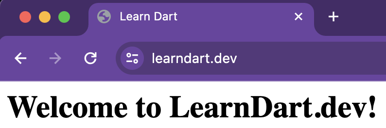
</div>

Great, it's working!

#### Configuring the app site

Now repeat the process for your app site. 

> **Note**: If you're only using your domain for MyApp, then you can add the `location /api` block below to the server block in the configuration file you just created for `learndart.dev`. You can then skip creating a new configuration file for `myapp.learndart.dev`.

Create the server configuration file:

```
sudo nano /etc/nginx/sites-available/myapp.learndart.dev
```

Add the config info to the file:

```
server {
    listen 80;
    server_name myapp.learndart.dev;

    location / {
        root /var/www/myapp.learndart.dev/html;
        index index.html;
    }

    location /api {
        proxy_pass http://localhost:8080;
        proxy_http_version 1.1;
        proxy_set_header Upgrade $http_upgrade;
        proxy_set_header Connection 'upgrade';
        proxy_set_header Host $host;
        proxy_cache_bypass $http_upgrade;
    }
}
```

For requests coming in for `myapp.learndart.dev`, you'll serve web content from the `html` folder you created earlier. However, there's also a special location block for `/api` requests. That means any request coming in for `myapp.learndart.dev/api` will be proxied (forwarded) to an internal server (localhost) listening on port 8080. This is where your Dart server will be running in a Docker container.

Repeat the other steps for enabling this site:

```
sudo ln -s /etc/nginx/sites-available/myapp.learndart.dev /etc/nginx/sites-enabled/
sudo nginx -t
sudo systemctl restart nginx
```

Visit your app site in a browser:

- [http://myapp.learndart.dev](http://myapp.learndart.dev)

<div style="text-align: center;">
    
</div>

Looks good.

Next, you'll add a certificate to your site to enable HTTPS encryption.

### Enabling HTTPS

TLS (Transport Layer Security) or SSL (Secure Sockets Layer) certificates are used to encrypt the traffic between your browser and the server. They're provided by a certificate authority (CA), which is a trusted third party that issues certificates. This is the requirement for using HTTPS rather than HTTP in your site address. That matters for your MyApp API especially because you don't want user data to appear in plain text to anyone who's sniffing the network traffic.

If you're using Cloudflare, then you already have a certificate for your domain. Kind of. [Cloudflare provides the certificate](https://developers.cloudflare.com/ssl/concepts/) for the traffic between the browser and Cloudflare's servers. But the traffic between Cloudflare and your server remains unencrypted. We're going to go the extra mile and use a certificate from [Let's Encrypt](https://letsencrypt.org/) to make sure the data is encrypted along the entire route.

#### Enabling Full (strict) encryption in Cloudflare

> **Note**: If you're not using Cloudflare, you can skip this step.

You need to tell Cloudflare that you will be using another SSL/TLS certificate for your site. To do that, go to your site in the Cloudflare dashboard. Then go to **SSL/TLS** in the menu and choose **Overview**.  Choose **Full (strict)** from the list of encryption mode options.

<div style="text-align: center;">
    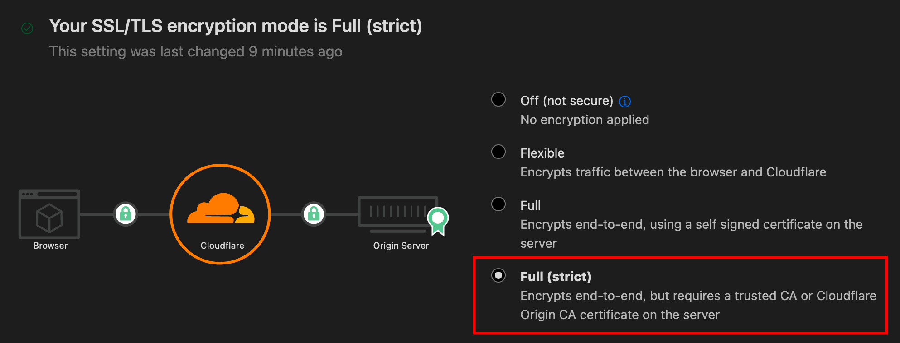
</div>

Now, if you visit [[your site](https://learndart.dev)](https://learndart.dev) in a browser, you'll see that your site is down. (You might have to refresh your browser cache.) It'll come back after you create the certificate in the next step.

#### Getting a certificate

Whether you are getting a certificate to encrypt traffic from your server to Cloudflare or using another registrar and encrypting your traffic from your server to the browser, the process of getting a certificate is the same. And thankfully it's pretty easy in Ubuntu 22.04 if you use the [Certbot](https://certbot.eff.org/pages/about) client for Let's Encrypt.

First, install Certbot on your server: 

```
sudo snap install core
sudo snap refresh core
sudo apt remove certbot
sudo snap install --classic certbot
sudo ln -s /snap/bin/certbot /usr/bin/certbot
```

Then tell Certbot which domains you want to get certificates for, swapping out your own domain names after the `-d` flags:

```
sudo certbot --nginx -d learndart.dev -d myapp.learndart.dev
```

You'll have to provide your email and agree to their terms of service. 

Cerbot will request TLS certificates for your site from Let's Encrypt and then update your server configuration files.

Open the files to see the changes that Certbot made:

```
sudo nano /etc/nginx/sites-available/learndart.dev
```

Here's the modified content:

```
server {
    server_name learndart.dev www.learndart.dev;

    location / {
        root /var/www/learndart.dev/html;
        index index.html;
    }

    listen 443 ssl; # managed by Certbot
    ssl_certificate /etc/letsencrypt/live/learndart.dev/fullchain.pem; # managed by Certbot
    ssl_certificate_key /etc/letsencrypt/live/learndart.dev/privkey.pem; # managed by Certbot
    include /etc/letsencrypt/options-ssl-nginx.conf; # managed by Certbot
    ssl_dhparam /etc/letsencrypt/ssl-dhparams.pem; # managed by Certbot
}

server {
    if ($host = learndart.dev) {
        return 301 https://$host$request_uri;
    } # managed by Certbot

    listen 80;
    server_name learndart.dev www.learndart.dev;
    return 404; # managed by Certbot
}
```

Note the following points:

- Now there are two server blocks. Certbot added another one that listens to port 443 (for HTTPS).
- HTTP requests (to port 80) are now redirected to HTTPS.

Also check out the changes to your app site:

```
sudo nano /etc/nginx/sites-available/myapp.learndart.dev
```

Here's the content:

```
server {
    server_name myapp.learndart.dev;

    location / {
        root /var/www/myapp.learndart.dev/html;
        index index.html;
    }

    location /api {
        proxy_pass http://localhost:8080;
        proxy_http_version 1.1;
        proxy_set_header Upgrade $http_upgrade;
        proxy_set_header Connection 'upgrade';
        proxy_set_header Host $host;
        proxy_cache_bypass $http_upgrade;
    }

    listen 443 ssl; # managed by Certbot
    ssl_certificate /etc/letsencrypt/live/learndart.dev/fullchain.pem; # managed by Certbot
    ssl_certificate_key /etc/letsencrypt/live/learndart.dev/privkey.pem; # managed by Certbot
    include /etc/letsencrypt/options-ssl-nginx.conf; # managed by Certbot
    ssl_dhparam /etc/letsencrypt/ssl-dhparams.pem; # managed by Certbot
}

server {
    if ($host = myapp.learndart.dev) {
        return 301 https://$host$request_uri;
    } # managed by Certbot

    listen 80;
    server_name myapp.learndart.dev;
    return 404; # managed by Certbot
}
```

Mostly this is the same, but I had you open this file to note that the `/api` proxy is still using HTTP on port `8080`, not HTTPS. That's because calls to `localhost` port `8080` are internal and not exposed to the public internet. Since presumably you are the only one with login access to the server, this is probably fine. For a larger company with multiple employees that have access to the server, you may need to consider additional security measures.

Visit your site ([https://learndart.dev](https://learndart.dev/)) in a browser and it should be working over HTTPS now. Congratulations!

<div style="text-align: center;">
    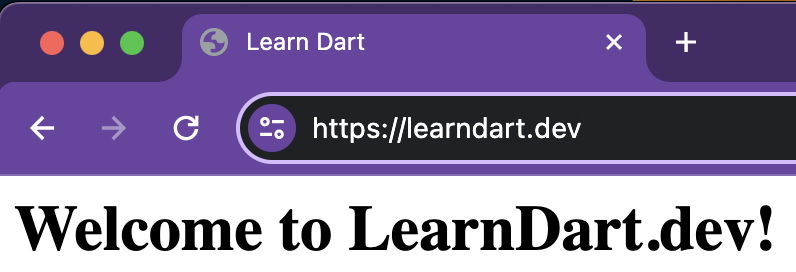
</div>

You can log out of your server for now:

```
exit
```

Next, you'll move on to Docker and Dart.

## Step 3: Docker

Before you actually get to Docker, you need to prepare your MyApp API server. While anything that runs in Docker is fine, for this tutorial, you'll use the default Dart Shelf server that is auto-generated when you create a new [Shelf](https://pub.dev/packages/shelf) project.

### Creating a sample Dart server

Assuming you have [Dart](https://dart.dev/get-dart) installed on your local machine, run the following command:

```
dart create -t server-shelf my_app_server
```

Test that it's working locally by starting the server:

```
cd my_app_server
dart run bin/server.dart
```

Open the following address in a browser:

- [http://localhost:8080](http://localhost:8080)

You should see `Hello, World!`:

<div style="text-align: center;">
    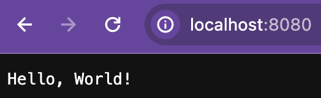
</div>

You can stop the server by pressing **Ctrl+C**.

### Evaluating alternative deployment options

Now that your server is ready to deploy, there are several options to run a Dart server on a VPS:

- You could install the Dart SDK on the server and run your app in JIT mode just like you do on your local machine during development.
- You could compile your Dart app to a standalone executable in AOT mode and run that on the server.
- You could bundle your app in a Docker image and run Docker on the server.

There are advantages and disadvantages to each of these options. The Docker option is relatively painless and it's nice to have everything isolated in its own container, so that's the route I'll take in this tutorial.

### Setting up Docker locally

[Docker](https://www.docker.com/) is a program that lets you to bundle all of the dependencies your project needs along with the project itself. This allows the application to run in a consistent environment regardless of the machine it's located on.

To start with, you need to [install Docker](https://www.docker.com/products/docker-desktop/) on your local machine. I'll leave that for you to figure out.

#### Browsing a Dockerfile

Have a look at the `Dockerfile` in your `my_app_server` project:

```
# Use latest stable channel SDK.
FROM dart:stable AS build

# Resolve app dependencies.
WORKDIR /app
COPY pubspec.* ./
RUN dart pub get

# Copy app source code (except anything in .dockerignore) and AOT compile app.
COPY . .
RUN dart compile exe bin/server.dart -o bin/server

# Build minimal serving image from AOT-compiled `/server`
# and the pre-built AOT-runtime in the `/runtime/` directory of the base image.
FROM scratch
COPY --from=build /runtime/ /
COPY --from=build /app/bin/server /app/bin/

# Start server.
EXPOSE 8080
CMD ["/app/bin/server"]
```

The comments in the file tell you what each step is doing. The main thing to understand is that the `Dockerfile` tells how to build a Docker image.

> **Note**: When learning Docker, you'll see the terms "image" and "container" a lot. Sometimes the difference can be confusing. You can think of an image like a Dart class and the container as an instance of that class. The image is a template for creating containers and the container is what actually runs on your system. [This article](https://circleci.com/blog/docker-image-vs-container/) is pretty good if you want a more in-depth explanation.

#### Building a Docker image

Now that you've installed Docker on your local machine, make sure Docker is running.

Then, from within your `my_app_server` project, run the following terminal command to build the Docker image:

```
docker build . -t myapp:v1.0.0
```

Here are a few notes:

- The default build platform is `linux/amd64`, which is what your Ubuntu server needs.
- `-t` defines the tag `myapp:v1.0.0` for the image.
- `myapp` is the image name and `v1.0.0` is the version.
- The image for your app is built on top of the official Dart Docker image. That means running the `build` command will download the Docker image and any other dependencies needed to build your app.

List the existing Docker images:

```
docker images
```

You should see something similar to the following:

```
REPOSITORY   TAG       IMAGE ID       CREATED          SIZE
myapp        v1.0.0    ac4498012b1b   5 minutes ago   10.1MB
```

#### Creating and starting a Docker container

Test your image to make sure it's working locally:

```
docker run -it -p 8080:8080 myapp:v1.0.0
```

Here are a few notes of what that does:

- The `run` command is a combination of `create` and `start`. It creates a Docker container and runs it.
- `-it` tells Docker to run the container in interactive mode.
- `-p` tells Docker to forward port `8080` on the container to port `8080` on your local machine.
- `myapp:v1.0.0` is the image to run.

> **Note**: My local machine is an Intel chip Mac and that's all I've tested this on. It runs the default image we created earlier. If you're running Windows or an Apple chip Mac, I'm not sure if you'll need to specify a different platform for the image build step. If you can let me know whether it's also working on these platforms, I'd appreciate it.

Open the following address in a browser:

- [http://localhost:8080](http://localhost:8080)

You should see `Hello, World!` again as you did when you ran your program directly with Dart.

#### Stopping a Docker container

Pressing **Ctrl+C** doesn't work to stop a running Docker container. To stop it, open another terminal and run:

```
docker ps
```

This will tell you the container ID:

```
CONTAINER ID   IMAGE          COMMAND             CREATED         STATUS         PORTS                    NAMES
e3da89cdf8ef   myapp:v1.0.0   "/app/bin/server"   5 minutes ago   Up 5 minutes   0.0.0.0:8080->8080/tcp   serene_morse
```

Then run the following command, replacing the container ID with your own:

```
docker stop e3da89cdf8ef
```

### Moving a Docker image to the server

Now it's time to copy your Docker image to the server.

First, save your image as a `tar` file:

```
docker save -o myapp-v1.0.0.tar myapp:v1.0.0
```

Copy the image to the home folder of your server:

```
scp myapp-v1.0.0.tar me@107.175.2.52:~
```

Log in to your server:

```
ssh me@107.175.2.52
```

Confirm that the image is there:

```
ls
```

### Setting up Docker on the server

Next you need to install Docker on the server. The following directions come from the [Docker docs](https://docs.docker.com/engine/install/ubuntu/). You can also check out the [DigitalOcean guide](https://www.digitalocean.com/community/tutorials/how-to-install-and-use-docker-on-ubuntu-20-04) for help.

First uninstall any old versions of Docker:

```
for pkg in docker.io docker-doc docker-compose docker-compose-v2 podman-docker containerd runc; do sudo apt remove $pkg; done
```

Then run each of the following commands to add Docker's official [GPG](https://en.wikipedia.org/wiki/GNU_Privacy_Guard) key:

```
sudo apt update
sudo apt install ca-certificates curl
sudo install -m 0755 -d /etc/apt/keyrings
sudo curl -fsSL https://download.docker.com/linux/ubuntu/gpg -o /etc/apt/keyrings/docker.asc
sudo chmod a+r /etc/apt/keyrings/docker.asc
```

Then add the Docker repository to the Apt sources:

```
echo \
  "deb [arch=$(dpkg --print-architecture) signed-by=/etc/apt/keyrings/docker.asc] https://download.docker.com/linux/ubuntu \
  $(. /etc/os-release && echo "$VERSION_CODENAME") stable" | \
  sudo tee /etc/apt/sources.list.d/docker.list > /dev/null
```

Update the packages again:

```
sudo apt update
```

Now you can finally install Docker:

```
sudo apt-get install docker-ce docker-ce-cli containerd.io docker-buildx-plugin docker-compose-plugin
```

Check that Docker is installed by running the following command:

```
sudo docker run hello-world
```

You should see a `Hello from Docker!` message among other output.

### Running your Docker image on the server

Now you can load the Docker image you saved earlier:

```
sudo docker load -i myapp-v1.0.0.tar
```

The `-i` flag refers to the input file.

Check to see if your image loaded:

```
sudo docker images
```

You should see output similar to the following:

```
REPOSITORY    TAG       IMAGE ID       CREATED          SIZE
myapp         v1.0.0    ac4498012b1b   51 minutes ago   10.1MB
hello-world   latest    d2c94e258dcb   12 months ago    13.3kB
```

Now start running your container:

```
sudo docker run -d --restart unless-stopped -p 8080:8080 myapp:v1.0.0
```

This is similar to the `run` command when you ran the Docker container on your local machine. Here are the new parts:

- `-d` runs the container in the background.
- `--restart unless-stopped` restarts the container when the server restarts. However, if you manually stop the container, it won't restart.
- `-p 8080:8080` again maps the server's port `8080` to the container's port `8080`. If you recall, port `8080` is where Nginx is forwarding `/api` requests to.

Check that the container is running:

```
sudo docker ps
```

You should see something like the following:

```
CONTAINER ID   IMAGE          COMMAND             CREATED         STATUS         PORTS                    NAMES
a1af7688de9a   myapp:v1.0.0   "/app/bin/server"   2 minutes ago   Up 2 minutes   0.0.0.0:8080->8080/tcp   relaxed_hermann
```

### Testing it out

First make sure that Docker is working internally on your server:

```
curl localhost:8080
```

You should get see `Hello, World!` on the command line.

Now for the big test. Go to your browser and navigate to

- [https://learndart.dev/api](https://learndart.dev/api)

You should see the `Hello, World!` message.

